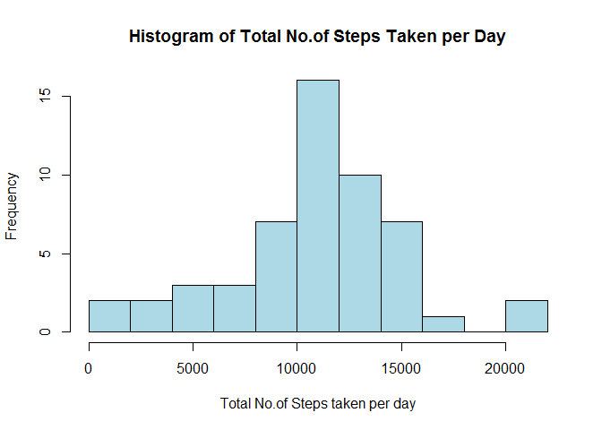
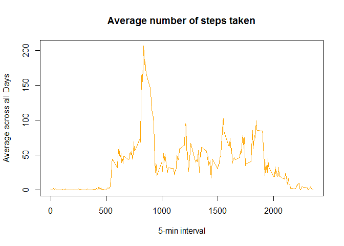
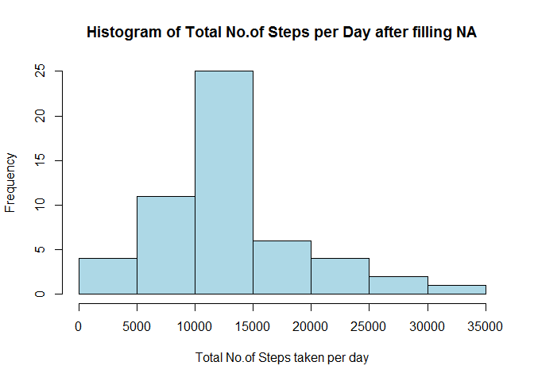
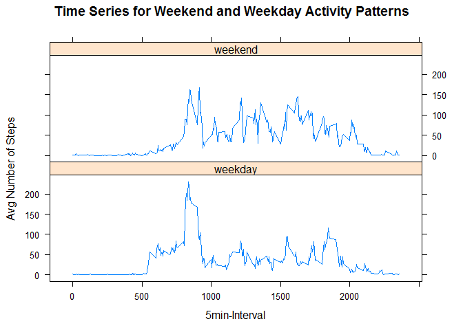

# Peer Assessment-1: Reproducible Research

##Introduction

It is now possible to collect a large amount of data about personal movement using activity monitoring devices such as a Fitbit, Nike Fuelband, or Jawbone Up. These type of devices are part of the "quantified self" movement - a group of enthusiasts who take measurements about themselves regularly to improve their health, to find patterns in their behavior, or because they are tech geeks. But these data remain under-utilized both because the raw data are hard to obtain and there is a lack of statistical methods and software for processing and interpreting the data.

This assignment makes use of data from a personal activity monitoring device. This device collects data at 5 minute intervals through out the day. The data consists of two months of data from an anonymous individual collected during the months of October and November, 2012 and include the number of steps taken in 5 minute intervals each day.

##Data

The data for this assignment was downloaded from the course web site:

Dataset: Activity monitoring data [52K]
The variables included in this dataset are:

steps: Number of steps taking in a 5-minute interval (missing values are coded as NA)

date: The date on which the measurement was taken in YYYY-MM-DD format

interval: Identifier for the 5-minute interval in which measurement was taken

The dataset is stored in a comma-separated-value (CSV) file and there are a total of 17,568 observations in this dataset.

##Assignment

This assignment was done in multiple steps shown below. 

### 1.Loading and preprocessing the data

Here is the code for loading and preprocessing data 


```r
data1<-read.csv("C:/Users/prman_000/Desktop/RProg/RepData/activity.csv")
data<-na.omit(data1)#Ignoring NA values in data frame
#Preprocessing data:Turning date into a valid date class  for easier processing
#Dates are in YYYY-MM-DD format
dates <- strptime(data$date, "%Y-%m-%d")
```

### 2.Calculating mean total number of steps taken per day

For this part of the assignment,missing values(NA)in the dataset were ignored.Calculating mean total no.of steps was done in multisteps.
First, steps data was split into steps per day and then calculated the total numberof steps per day. As suggested histogram for the total number of steps per day was plotted.Then mean and median were reported.  
Code for this is as follows.


```r
#Spliting data frame for steps by day
stepsaday <- split(data$steps, dates$yday)

#Finding total number of steps for each day
Totalsteps <- sapply(stepsaday, sum)

#Making histogram of the total number of steps taken each day
hist(Totalsteps,breaks=10,col='lightblue',xlab="Total No.of Steps taken per day",main="Histogram of Total No.of Steps Taken per Day")
```

 

```r
#Finding mean and median of the total number of steps taken per day
mean(Totalsteps)
```

```
## [1] 10766.19
```

```r
median(Totalsteps)
```

```
## [1] 10765
```

###3.The average daily activity pattern

The average number of steps taken were estimated and the time-series plot for 5-minute interval (x-axis) and the average number of steps taken, averaged across all days (y-axis) was drawn. Also,  5-minute interval for which, the maximum number of steps taken was found.

This was done with the following code.


```r
# Finding the average number of steps taken, averaged across all days
avgsteps<- tapply(data$steps, data$interval, mean)
plot(row.names(avgsteps),avgsteps, type = "l", xlab = "5-min interval", 
     ylab = "Average across all Days", main = "Average number of steps taken", 
     col = "orange")
```

 

```r
##Interval with max no.of steps
Intervalmax<-which.max(avgsteps)
names(Intervalmax)
```

```
## [1] "835"
```

Observations:

Based on the plot,this person's daily activity peaks around 8:35am.

###4.Imputing missing values

Note that there are a number of days/intervals where there are missing values (coded as NA). The presence of missing days may introduce bias into some calculations or summaries of the data.

So,the total number of missing values in the dataset (i.e. the total number of rows with NAs) was calculated as follows.


```r
#Totalno.of missing values
TotalNA<- sum(is.na(data1$steps))
TotalNA
```

```
## [1] 2304
```

Average steps in 5-min interval was found and those values were used to replace the missed NA values.


```r
#Filling NA with avg steps in 5 min interval
Avgsteps<- aggregate(steps ~ interval, data = data1, FUN = mean)
fillNA <- numeric()
for (i in 1:nrow(data1)) {
  val <- data1[i, ]
  if (is.na(val$steps)) {
    steps <- subset(Avgsteps, interval == val$interval)$steps
  } else {
    steps <- val$steps
  }
  fillNA <- c(fillNA, steps)
}

#final data 
dataf<- data1
dataf$steps <- fillNA
```

A Histogram of total steps per day after filling the 'NA' data was drawn.


```r
#Histogram of totalsteps after filling NA
stepsadayf <- split(dataf$steps, dates$yday)
```

```
## Warning in split.default(dataf$steps, dates$yday): data length is not a
## multiple of split variable
```

```r
#Finding total number of steps for each day
Totalstepsf <- sapply(stepsadayf, sum)
hist(Totalstepsf,breaks=10,col='lightblue',xlab="Total No.of Steps taken per day",main="Histogram of Total No.of Steps per Day after filling NA")
```

 

Mean and median of the total number of steps taken per day after filling NA were calculated.


```r
#Finding mean and median of the total number of steps taken per day after filling NA
mean(Totalsteps)
```

```
## [1] 10766.19
```

```r
median(Totalsteps)
```

```
## [1] 10765
```

Observations:

1.From the above results, it was observed that, there is no significant change in mean and median of the Total number of steps per day after imputting the missing data.

2.The shape of the histogram remains the same as the histogram from removed missing values. However, the frequency counts increased as expected. 

###5.Differences in activity patterns between weekdays and weekends

The dataset with the filled-in missing values was used for this part.From this data,day was changed to either weekday or weekend. Then data was stored in averages data set.


```r
weekday.or.weekend <- function(date) {
  day <- weekdays(date)
  if (day %in% c("Monday", "Tuesday", "Wednesday", "Thursday", "Friday")) 
    return("weekday") else if (day %in% c("Saturday", "Sunday")) 
      return("weekend") else stop("invalid date")
}
dataf$date <- as.Date(dataf$date)
dataf$day <- sapply(dataf$date, FUN = weekday.or.weekend)
averages <- aggregate(steps ~ interval + day, data = dataf, mean)
```

The comparision plot between weekday and weekend was plotted as follows


```r
library(lattice)
xyplot(steps~interval|day,averages, type = "l", layout = c(1, 2), ylab = "Avg Number of Steps", xlab = "5min-Interval", 
       main = "Time Series for Weekend and Weekday Activity Patterns")
```

 

Observations:

1.From the above plot,it is clear that this person is more active during weekend.

2. On weekdays this person is more active in the morning (around 9 AM), and is much more inactive through out the day. This spike might be due to commute.

